# CI (lógica + pruebas sobre funciones)

## Funciones obligatorias (en src/utils/)

1. **calcWeightedGrade(items)**

Calcula una nota final ponderada a partir de componentes con peso.

- items: arreglo de objetos {score: número 0–100, weight: número 0–1}.
- Suma de weight = 1 con tolerancia ±0.001; si no, RangeError.
- Devuelve nota 0–100 con 2 decimales.
- Validar tipos/rangos; lanzar TypeError/RangeError según corresponda.

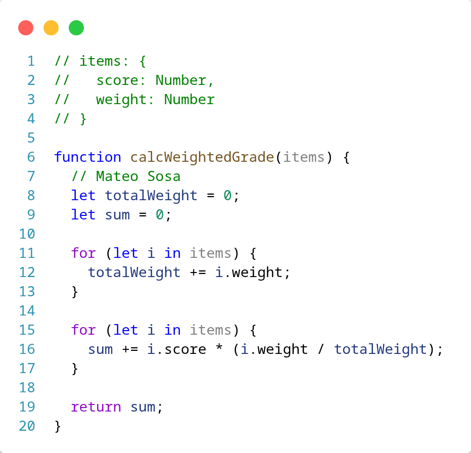

2. **percentile(p, values)**

Devuelve el percentil p de una lista de números usando el método de rango más cercano (sin interpolación).

- p en [0,100]; values: arreglo de números, longitud >= 1.
- Ordena ascendentemente; rank = ceil(p/100 × N) con indexación 1..N.
- Regla explícita para bordes: si p = 0 → devuelve mínimo; si p = 100 → máximo.
- Resultado con 2 decimales; validar tipos/rangos; lanzar errores apropiados.

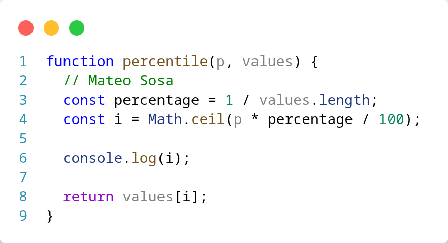

## Casos de referencia que deben pasar en tests:

- calcWeightedGrade([{score:80,weight:0.4},{score:90,weight:0.6}]) → 86.00

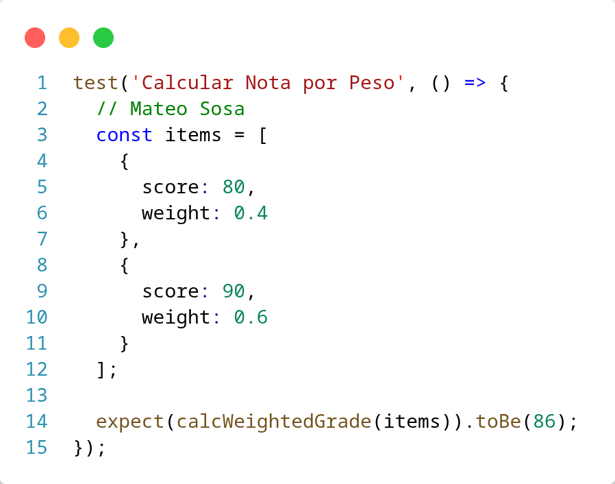

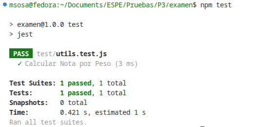

- percentile(0,[1,2,3]) → 1.00 ; percentile(100,[1,2,3]) → 3.00
- percentile(50,[1,2,3,4]) → 2.00 (nearest-rank)

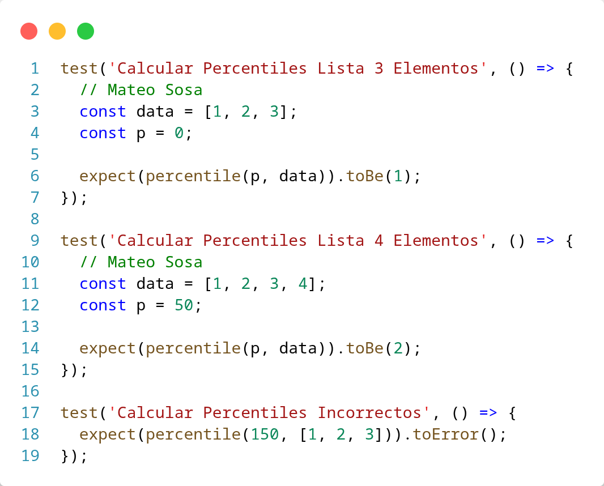

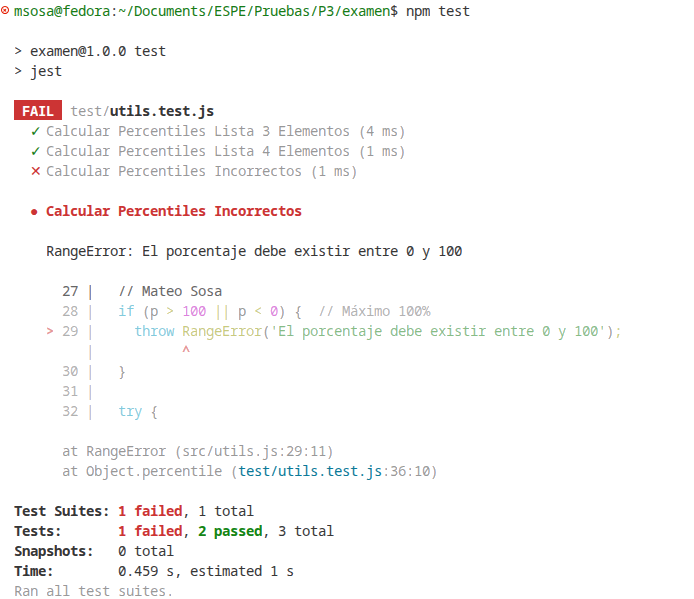

## Criterios de aceptación CI (NRC B)

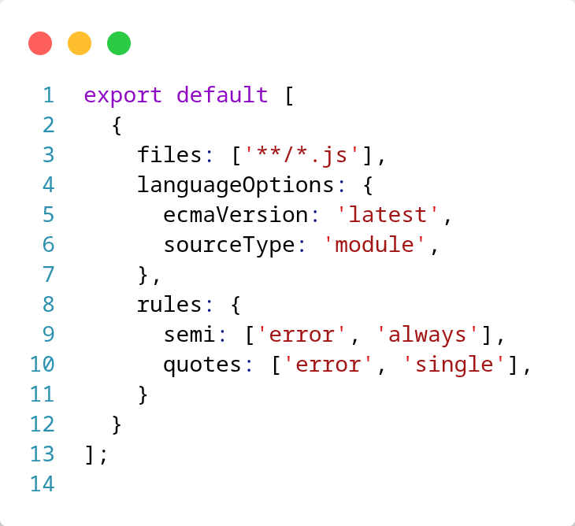

- CI corre en push/PR a main.

- Lint sin errores.

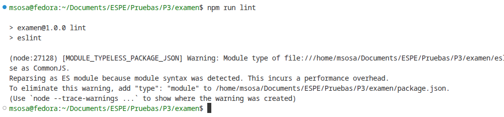

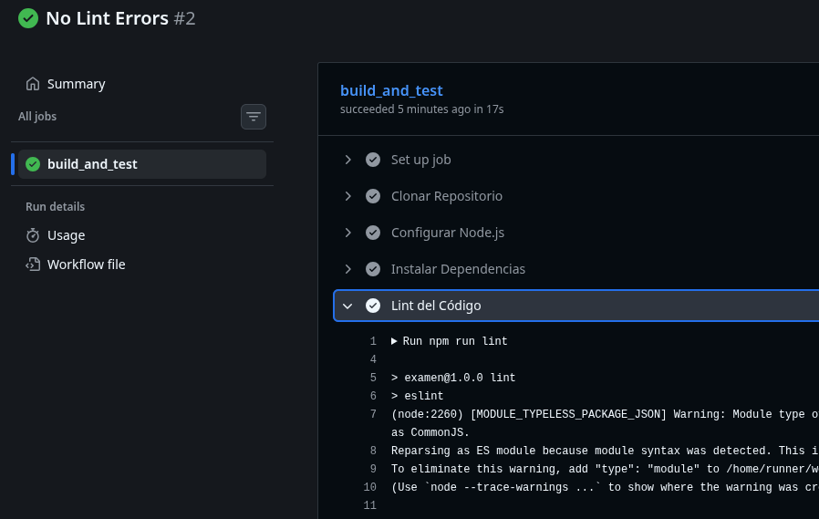

# CD (despliegue a Firebase con página estática)

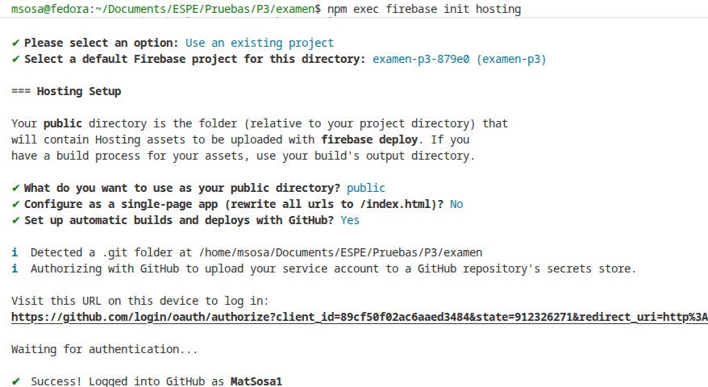

Página requerida

- Título: “Perfil — Notas & Estadística”.
- Contenido mínimo:
    - Nombre completo, NRC, correo institucional.
    - Un párrafo corto de presentación (3–5 líneas).
    - Una tabla sencilla con 3–4 asignaturas y calificaciones simuladas (no reales).
- Estilos básicos (sin frameworks):
    - Encabezado y secciones con bordes suaves; paleta de 2–3 colores; tipografía sans.

## Criterios de aceptación CD

- Preview visible en el PR (URL única del preview).

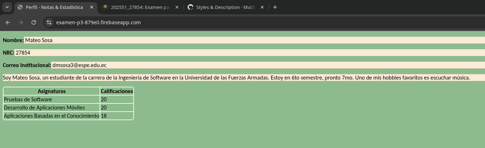

El link de acceso es: [https://examen-p3-879e0.firebaseapp.com/](https://examen-p3-879e0.firebaseapp.com/)

- Live al hacer merge a main (condicionado a CI verde).

